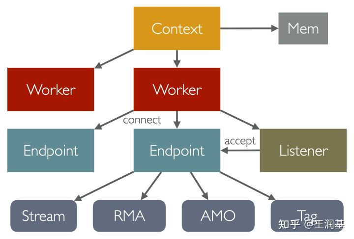
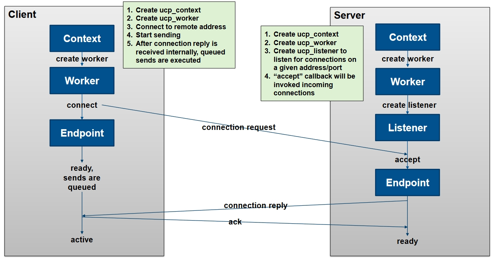

# 什么是EP
DOCA提供了一组通讯API可以让DPA访问远程内存。通讯API基于UCX UCP APIs, 并且目前只支持IB模式。\
RDMA通讯由EP管理。EP包含了一个AP。 EPs可以是可靠链接也可以是动态可靠连接。

EP由Host侧应用创建并将对应的handle传递给DPA上的应用。

doca_dpa_ep_create -> doca_dpa_ep_dev_export


# 相关知识
## UCX
[UCX介绍](https://blog.csdn.net/bandaoyu/article/details/125207112) \
[DOCA UCX Programming Guide](https://docs.nvidia.com/doca/sdk/ucx-programming-guide/index.html)

UCX 的全称是 Unified Communication X。正如它名字所展示的，UCX 旨在提供一个统一的抽象通信接口(TCP、GPU、RDMA等)，能够适配任何通信设备，并支持各种应用的需求。

组成部分：
UCX 的全称是 Unified Communication X。正如它名字所展示的，UCX 旨在提供一个统一的抽象通信接口，能够适配任何通信设备，并支持各种应用的需求。

UCP(Protocol)：	
Implements high-level abstractions such as tag-matching, streams, connection negotiation and establishment, multi-rail, and handling different memory types\
实现上层抽象，如标记匹配、流、连接协商和建立、多轨以及处理不同的内存类型\

UCT(Transport):	
Implements low-level communication primitives such as active messages, remote memory access, and atomic operations \
实现底层通信原语，如active messages、远程内存访问和原子操作

UCS(Services):A collection of data structures, algorithms, and system utilities for common use \ 
常用的数据结构、算法和系统实用工具的集合

UCM(Memory):A collection of data structures, algorithms, and system utilities for common use \
常用的数据结构、算法和系统实用工具的集合 \

UCX 采用了以异步 IO 为核心的编程模型。其中 UCP 层定义的核心对象有以下四种：

* Context：全局资源的上下文，管理所有通信设备。一般每个进程创建一个即可。
* Worker：任务的管理调度中心，以轮询方式执行任务。一般每个线程创建一个，会映射为网卡上的一个队列。
* Listener：类似 TCP Listener，用来在 worker 之间创建连接。
* Endpoint：表示一个已经建立的连接。在此之上提供了各种类型的通信接口

它们之间的所属关系如下图所示:\
 \

### 建立连接
UCX 中双方首先要建立连接，拿到一个 Endpoint 之后才能进行通信。建立连接一般要通过 Listener，过程和 TCP 比较类似：\
通信双方 A/B 首先建立各自的 Context 和 Worker，其中一方 A 在 Worker 上创建 Listener 监听连接请求，Listener 的地址会绑定到本机的一个端口上。用户需要通过某种方法将这个地址传递给另一方 B。B 拿到地址后在 Worker 上发起 connect 操作，此时 A 会收到新连接请求，它可以选择接受或拒绝。如果接受则需要在 Worker 上 accept 这个请求，将其转换为 Endpoint。之后 B 会收到 A 的回复，connect 操作完成，返回一个 Endpoint。此后双方就可以通过这对 Endpoint 进行通信了。
 \

### 内存注册
对于常规的通信接口，用户可以直接在 Endpoint 上发起请求。但对于 RMA（远程内存访问）操作，需要被访问的一方首先在自己的 Context 上注册内存，同时指定访问权限，获得一个 Mem handle。然后将这个本地 handle 转化为其他节点可以访问的一串 token，称为 remote key（rkey）。最后想办法把 rkey 传给远端。远端拿着这个 rkey 进行远程内存访问操作。

### 异步任务处理（重点）
为了发挥最高的性能，整个 UCX 通信接口是全异步的。所谓异步指的是 IO 操作的执行不会阻塞当前线程，一次操作的发起和完成是独立的两个步骤。如此一来 CPU 就可以同时发起很多 IO 请求，并且在它们执行的过程中可以做别的事情。\
不过接下来问题来了：程序如何知道一个异步任务是否完成了？常见的有两种做法：主动轮询，被动通知。前者还是需要占用 CPU 资源，所以一般都采用通知机制。在 C 这种传统过程式语言中，异步完成的通知一般通过 回调函数（callback）实现：每次发起异步操作时，用户都需要传入一个函数指针作为参数。当任务完成时，后台的运行时框架会调用这个函数来通知用户。下面是 UCX 中一个异步接收接口的定义：
```
ucs_status_ptr_t ucp_tag_recv_nb (
  ucp_worker_h worker,
  void ∗ buffer,
  size_t count,
  ucp_datatype_t datatype,
  ucp_tag_t tag,
  ucp_tag_t tag_mask,
  ucp_tag_recv_callback_t cb  // <-- 回调函数
);
 
// 回调函数接口的定义
typedef void(∗ ucp_tag_recv_callback_t) (
  void ∗request, 
  ucs_status_t status,        // 执行结果，错误码
  ucp_tag_recv_info_t ∗info   // 更多信息，如收到的消息长度等
);
```
这个接口的语义是：发起一个异步 Tag-Matching 接收操作，并立即返回。当真的收到 tag 匹配的消息时，UCX 后台会处理这个消息，将其放到用户提供的 buffer 中，最后调用用户传入的 callback，通知用户任务的执行结果。

[DOCA DPA](https://docs.nvidia.com/doca/sdk/ucx-programming-guide/index.html)是支持UCX库的，application下有个all reduce的例子，但是好像是基于ARM。