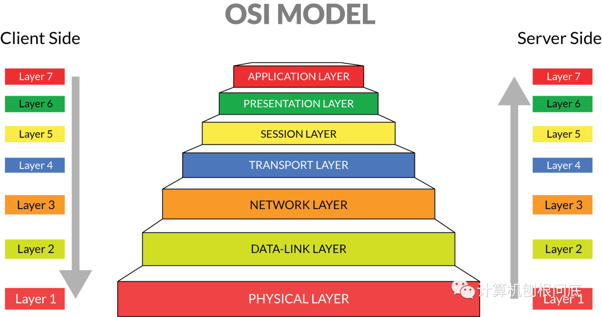
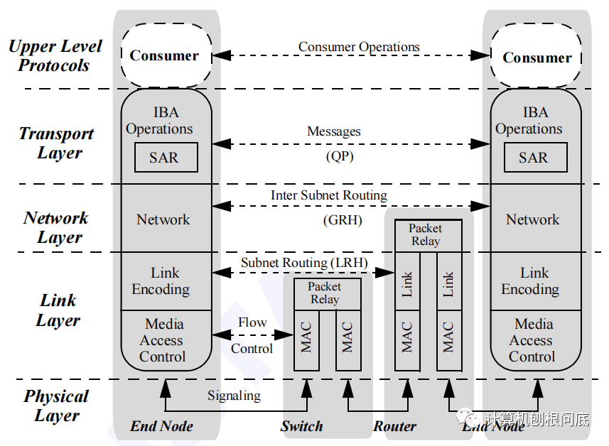
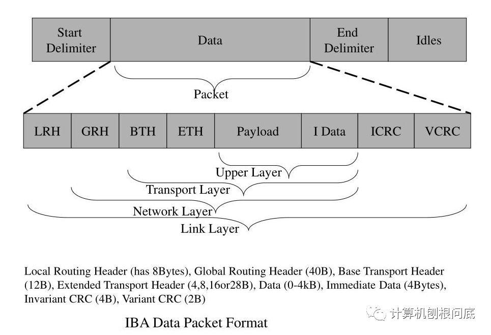
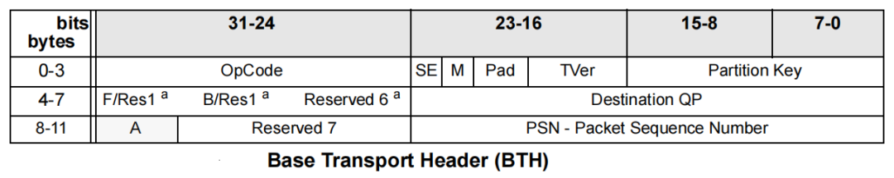
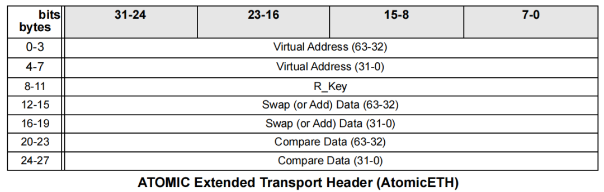
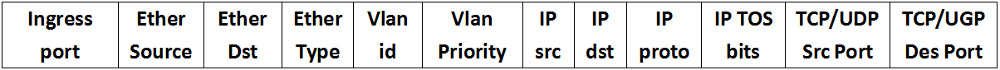

# 背景知识
“计算机科学中的所有问题都可以通过增加一个间接层来解决”。应该可以怎么说，所有的互联通信协议都可以参考OSI开发互联模型的架构去设计或简化，OSI 代表开放系统互连。它由 ISO（国际标准化组织）于 1984 年开发。它是一个 7 层架构，每一层都有特定的功能要执行。OSI模型每一层协同工作，将数据在节点之间进行传输。\
 \
传输层以上负责报文更偏向应用的寻址管理，比如将报文送给A进程，而不是B进程。网络层以下负责报文在网络中路由，进而转发到目的地。本质上网络传输就是一个寻址的过程。类似的通信模型有，如典型的TCP/IP四层通信模型，PCIe协议通信模型。\
而IBA也不例外。IBA操作可以被描述为一系列的层。每一层的协议都是独立于其他层的。每个层都依赖于它下面的层的服务，并为它上面的层提供服务。IBA可以分为ULP层也就是应用层，传输层、网络层、链路层、物理层。我们完全可以把它与TCP/IP四层通信模型类比理解。
 \

# RDMA 传输层
传输层涉及到上层应用的寻址，一般是协议栈中相对比较复杂的一层。无论是InfiniBand还是RoCE都一样需要关心这一层的设计，因为RoCE是包含BTH的报文头的。传输层负责将数据包送到对应的QP并指示QP如何处理数据包的数据。\
 \
在DPA中修改报文头，或许就可指定包位置。传输层的报文头Base Transport Header (BTH) 它包含了目标QP，操作码、数据包序列号等字段。\
 \
操作码标识数据包是否是消息的第一个、最后一个、中间的或唯一的数据包，并指定操作(Send、RDMA Write、Read、Atomic)。\

数据包序列号PSN(packet sequence number)在通信第一次建立过程时初始化，并且每次QP创建新数据包时都会递增。接收端的QP跟踪接收的PSN序列号，以确定是否丢失了数据包。

对于可靠(如RC，RD)类型的服务，接收方会发送ACK/NAK数据包，以通知发送方数据包是否收到。如果接收方发现丢包，它会丢弃后续数据包，直到发送方重新发送丢失的消息。

对于不可靠服务(如UD，UC)的服务，当接收方检测到丢失的数据包时，它会中止当前操作，并丢弃所有后续数据包，直到再接收到一个新的操作指令的首包，然后继续进行相关的操作。


 \
对于RDMA READ或WRITE操作的首包会包含一个RDMA ETH，用于指定要读取或写入的数据缓冲区的虚拟地址、R_Key和总长度。

对于WRITE操作，首包发送之后，剩余数据随后的RDMA写入数据包提供剩余的数据。接收端QP需要校验Header中提供的内存访问地址是否是该QP注册的内存，并确保写入的总数据量不超过指定的长度。

对于RDMA读取操作，接收端QP获取数据，将其切分为大小合适的(根据MTU进行切分)数据包，并将其发送给发起者。发送端在接收RDMA read response时，QP将数据写入RDMA读取请求的WQE中指定的缓冲区中。

 \
对于Atomic操作包含Atomic ETH，用于指定操作对象的内存地址和R_Key，以及两个操作数。QP校验该内存是否是该QP注册的内存。QP获取数据，将该值返回给发起者，执行相应操作操作，并将结果写回内存。

对于Compare & Swap操作，QP将内存地址指定的内容与第一个操作数进行比较，如果它们匹配，则将第二个操作数写入相同的位置。否则，就不进行修改。

对于Fetch &Add操作，QP使用 Atomic ETH中的64 bit 添加数据字段执行无符号添加，并将结果写回相同的内存位置。

在这两种情况下，操作都是原子的，也就是说别的QP是不允许在读取和随后的写入之间修改该内存位置的内容。


# DPA相关接口

This function returns the remote memory key for a memory region that  as registered. To obtain an rkey, the memory region must have been provided remote access capabilities, otherwise,  an error is returned and rkey is set to zero

doca_dpa_mem_rkey_get

# 具体实现v1.0 
在DPA中建立流表对流进行实现管理策略，流表可以通过rpc的方式进行修改。

## 流表
1.流表最常用的动作：forward,discard(drop),Next table\
2.流表就是交换机里的一张转发表，类似交换机的MAC表和路由器的路由表。\
3.每一个流表项都有各种动作\
4.流表由一条条的流表项（路由条目）组成。\
5.可以包含多个流表\
6.流表由主机建立，通过RPC下发\
流表项通过包含header fields,counters,actions。\

Header Fields(包头域)的主要内容如下
包头域主要是不再分层，简单的说，就是除了进接口，传统2层到4层的寻址信息都出现在包头域中（MAC，IP，PORT）\
 
L2_reflecoter使用的匹配表如下,基本包含了上述包头里的域：
```
struct mlx5_ifc_dr_match_spec_bits {
	uint8_t smac_47_16[0x20];
	uint8_t smac_15_0[0x10];
	uint8_t ethertype[0x10];
	uint8_t dmac_47_16[0x20];
	uint8_t dmac_15_0[0x10];
	uint8_t first_prio[0x3];
	uint8_t first_cfi[0x1];
	uint8_t first_vid[0xc];
	uint8_t ip_protocol[0x8];
	uint8_t ip_dscp[0x6];
	uint8_t ip_ecn[0x2];
	uint8_t cvlan_tag[0x1];
	uint8_t svlan_tag[0x1];
	uint8_t frag[0x1];
	uint8_t ip_version[0x4];
	uint8_t tcp_flags[0x9];
	uint8_t tcp_sport[0x10];
	uint8_t tcp_dport[0x10];
	uint8_t reserved_at_c0[0x18];
	uint8_t ip_ttl_hoplimit[0x8];
	uint8_t udp_sport[0x10];
	uint8_t udp_dport[0x10];
	uint8_t src_ip_127_96[0x20];
	uint8_t src_ip_95_64[0x20];
	uint8_t src_ip_63_32[0x20];
	uint8_t src_ip_31_0[0x20];
	uint8_t dst_ip_127_96[0x20];
	uint8_t dst_ip_95_64[0x20];
	uint8_t dst_ip_63_32[0x20];
	uint8_t dst_ip_31_0[0x20];
};
```
## 计数器Counters

主要对每张表，每个端口，每个流等进行计数，方便流量监管（例如经过这个端口有多少流量？匹配这个流的数据包有多少了、这张表查找了多少次？）主要是将流量可视化

## 动作Actions
即是对匹配到的流进行处理，传统网络中要不转发要不丢弃，没有第三种选择，openflow1.0规定了必备动作（Require Action）和可选动作（Optional Actions）