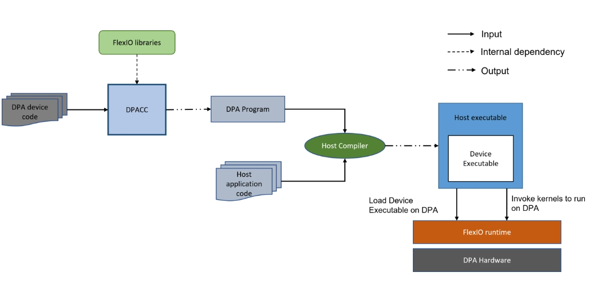

# DPACC
本文想要搞清楚如下几个问题：
1、DPACC可以编译哪些程序，指令集或者程序复杂度是否和eBPF一样受限，是否支持Doca提供的各种库函数。\
2、编程模型与执行流程

## DPACC 是什么
DPACC是DPA处理器的高级编译器，它将数据路径加速器(DPA)处理器的目标代码编译为设备可执行文件并生成DPA程序。\
DPA程序是一个带有接口的主机库，封装了设备可执行文件。这个DPA程序与宿主应用程序链接以生成宿主可执行文件。宿主可执行文件可以通过FlexIO运行时API调用DPA代码。\
DPACC使用DPA编译器(DPA-clang)来编译针对DPA的代码。DPA-clang是DPA工具链包的一部分，DPA工具链是一个基于llvm的交叉编译裸金属工具链。它提供Clang编译器、针对DPA架构的LLD链接器和其他实用程序。

### 卸载流程
 \
如上图所示，DPA程序通常由三个部分组成：1）DPA device code；2）Host主机程序；3）Runtime（FlexIO or DOCA DPA library）
典型的卸载目录下，包括了DPA可执行文件，Host主机程序，DPA程序前显示加上_dpacc告知编译器生成可执行文件，编译器通过可执行文件的名称在编译时将其与主机文件链接起来。

## DPA限制
目前DPA只支持C语言，能够使用的接口比如[FlexIO](./Bluefield3环境搭建/Flexio.md)或者DOCA-DPA，且在编码时有如下限制：\
1.变量不允许使用本地存储\
2.代码前置_dpacc\
3.DPA核目前不支持浮点计算，任何浮点运算指令都是不支持的\
4.__dpa_rpc__定义的同步函数，其返回值必须时uint64_t,__dpa_global__定义的事件触发函数返回来行必须是void.
5.带注释（带注释我理解的就是带上__dpa_global__前缀）的函数不能接受可变数量的参数\
6.带注释的函数不能接受C指针和数组作为参数(例如，void my_global (int *ptr, int arr[]))
7.内联不允许用于标记函数
8.用户定义的数据类型，当用作全局函数参数时，需要特殊处理。它们必须用__dpa_global__属性进行注释。

## DPACC
DPACC编译与链接程序的使用方法[DPACC](https://docs.nvidia.com/doca/sdk/dpacc-compiler/index.html#dpacc-inputs-and-outputs)

