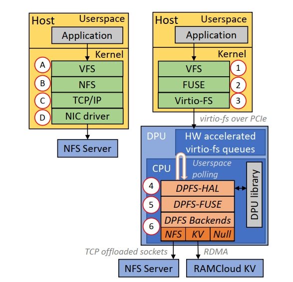

# 论文阅读记录
## 作者/机构
IBM
## 开源内容
### Docs
[ACM DL](https://dl.acm.org/doi/10.1145/3579370.3594769)

[OpenFabrics Alliance Workshop '23 Slides](https://www.openfabrics.org/wp-content/uploads/2023-workshop/2023-workshop-presentations/day-3/303_PGootzen.pdf)
### Code
[Github DPFS](https://github.com/IBM/DPFS)
## Background and Motivation
分布式文件系统（HadoopFs，Ceph, GluseterFs）以及云原生文件系统(Amazon EFS , AliBaba Pangu,Azure Files)被广泛运用于云存储领域.

但是构建一个高性能弹性云原生文件系统是具有挑战的。
1）网络以及存储性能的增长速度远高于CPU性能增长，需要使用更多CPU资源满足设备性能。

2）客户端逻辑臃肿，通常包括了元数据/数据服务器的通讯与协调，缓存管理等功能。每个客户端可能消耗GB级别的DRAM来实现（比如juiceFS，缓存还可能占用本地存储一半的容量）。这也限制了一台服务器上容纳虚拟机或者容器的数量。

3）这些文件系统都有相似的API，不好进行扩展以及系统优化。比如裸金属使用Ceph之后不好切换到HopesFS/InfiniFS.

## Desigen
核心思想:

1）虚拟化文件系统API，实现前后端解耦

2）将文件系统实现卸载到DPU（可以实现在应用级别或者是块层，但是快层卸载写放大可能比较严重）

 

DPFS由三层组成
1）DPFS-HAL：提供设备抽象以及管理接口

2）DPFS-Fuse: 提供 Fuse-like API（基于virtio-fs） 

3）file system backend (作者提供了NFS，NULL，KV三种后端)

## Experiment
### 关键指标分析
1）虚拟化overhead
2）多个backend的IO性能提升
3）NFS路径优化（包括需要的指令，指令效率，分支预测缺失率，L1 dcache miss rate）
### 实验结果

##Key Insight
virtio-fs 没有使用多队列，以及fues包头需要多个页面会导致较差的性能

将SR-IOV 和 Fues 结合起来可以跳过BF2上性能较弱的CPU，性能可能会更强（对于这点着会不会是BF2编程模式的问题？因为BF2使用DOCA数据必须先流经ARM核心，其他的DPU不知道会怎么样，在这里DODK/BPF可以提供什么能力呢？）
