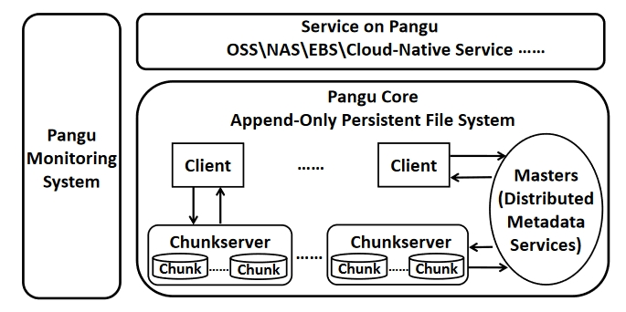

# 论文阅读记录
## 作者/机构
Alibaba
## 开源内容
### Docs
[Usenix](https://www.usenix.org/system/files/fast23-li-qiang_more.pdf)

## Introduction
本文讲解了近十年以来pangu文件系统的进化历史

## Pangu 1.0 2009~2015

存储介质：HDD; I/O延迟 ms-level;
架构设计：基于EXT4分布式的内核文件系统，网路栈也在内核

支持的文件格式： Tempfile Logfilie

## Pangu 2.0 2015~
进化的主要原因：高速NVMe SSD以及RDMA网络的发展 设计目标 I/O延迟达到100us

出现的问题：（1）许多支持随机访问的文件类型在SSD上的性能并不强 （2）内核软件栈会导致性能下降（数据拷贝、中断）（3）服务器中心的数据中心向资源分解数据中心架构可能会增加IO时延

针对上述问题pangu又进化了几次：

### 进化
1、设计了一个持久层，并且包含一个块层并写IO的延迟、\
2、设计了一个用户态操作系统（USSOS）对用户态存储软件栈以及网络软件栈\
3、保证了在动态环境下SLA，以降低99.9%的尾延迟
### 超进化
第二次进化的原因是业务升级，客户机数量越来越多，对于高性能的需求越来越高\
对原有的服务器以及交换机的拓扑结构进行扩展不具备经济型，因此阿里特地设计了大容量的存储专用服务器（96TB SSD以及100Gbps网络）\
网络优化技术：1、网络流量优化 2、RDCA 远程cache访问，减少序列化反序列化并减少CPU占用

## Background
 \
盘古组成部分：\
Core:由client、master以及chunkserver组成\
client用于向云服务提供EBS、OSS(对象存储)，运行时负责接受文件请求，冗余备份，SLA以及一致性\
Master用于管理元数据（目录树、命名空间以及文件地址向chunk地址的转换的映射表等），对目录树进行分区提高局部性，再利用哈希进一步分区实现负载均衡\
chunkserver用于存储数据，通过用户态文件系统并且支持不同的硬件